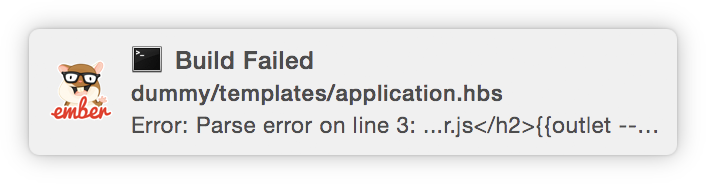
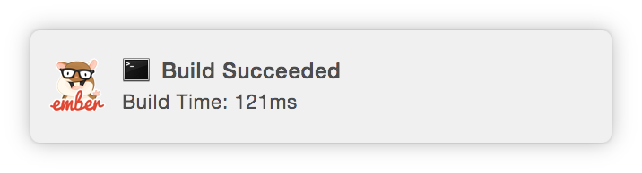

# Ember-cli-build-notifications

This library adds support for Linux, Mac OS X and Windows alerts when ember-cli has a buildError and postBuild (When build is successful).




## Usage

```bash
npm install --save-dev ember-cli-build-notifications
```

## Defaults and Overrides

| Config Options | Ember CLI Build Event | Default |
| -------------- |:----------------------|:-------:|
| buildError     | buildError            | True    |
| buildSuccess   | postBuild             | False   |

To override defaults, add the following to the config file `{app}/config/build-notifications.js`:

```
module.exports = {
  buildError: {
    notify: true
  },
  buildSuccess: {
    notify: true
  }
};
```


## Requirements

- **Mac OS X**: >= 10.8 or Growl if earlier.
- **Linux**: notify-osd installed (Ubuntu should have this by default)
- **Windows**: >= 8, task bar balloon if earlier or Growl if that is installed.
- **General Fallback**: Growl

Powered by [mikaelbr/node-notifier](https://github.com/mikaelbr/node-notifier) and its [dependencies](https://github.com/mikaelbr/node-notifier#thanks-to-oss).

## Contributing

### Running Tests

* `npm test`

## Acknowledgment

* Made possible by: [https://github.com/ember-cli/ember-cli/pull/2832](https://github.com/ember-cli/ember-cli/pull/2832)
* Inspired by: [https://github.com/dylang/grunt-notify](https://github.com/dylang/grunt-notify)
* Mocha setup from: [https://github.com/rwjblue/ember-cli-divshot](https://github.com/rwjblue/ember-cli-divshot)

## License

MIT
